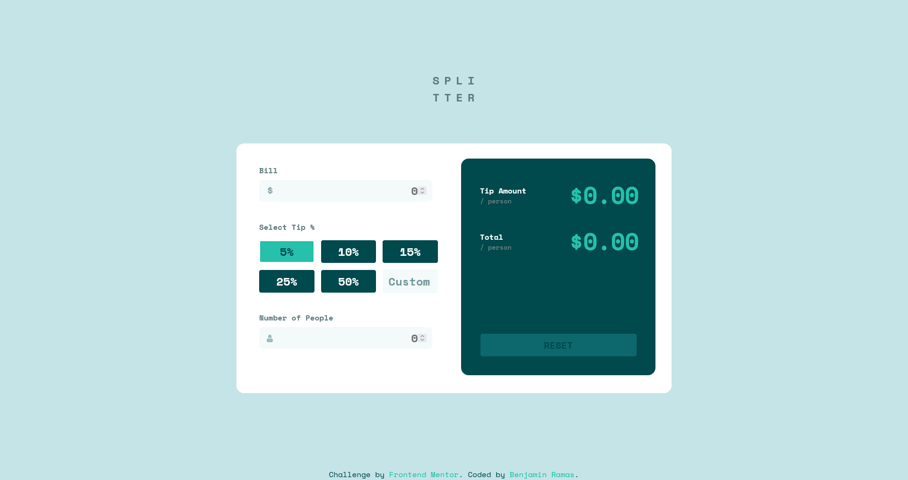
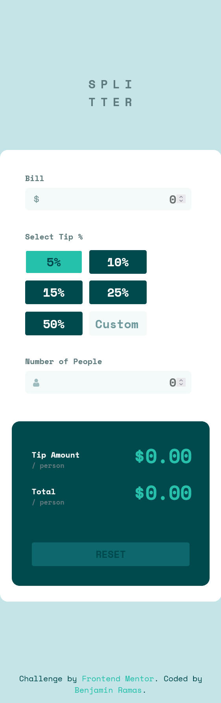

# Frontend Mentor - Tip calculator app solution

This is a solution to the [Tip calculator app challenge on Frontend Mentor](https://www.frontendmentor.io/challenges/tip-calculator-app-ugJNGbJUX). Frontend Mentor challenges help you improve your coding skills by building realistic projects.

## Table of contents

- [Overview](#overview)
  - [The challenge](#the-challenge)
  - [Screenshots](#screenshots)
  - [Links](#links)
- [My process](#my-process)
  - [Built with](#built-with)
  - [What I learned](#what-i-learned)
  - [Continued development](#continued-development)
- [Author](#author)

## Overview

### The challenge

Users should be able to:

- View the optimal layout for the app depending on their device's screen size
- See hover states for all interactive elements on the page
- Calculate the correct tip and total cost of the bill per person

### Screenshots

### Links

- Solution URL: [Add solution URL here](https://your-solution-url.com)
- Live Site URL: [Add live site URL here](https://your-live-site-url.com)

## My process

1. I start off by creating a very simple html layout with no css styling

2. I tried out a new technique where I had the design image as an image background so I could more accurately recreate it

3. With this I create the styling using Sass

### Built with

- Semantic HTML5 markup
- CSS custom properties
- Sass

### Continued development

This version is still unfinished and I plan on updating it with javascript

## Author

- Frontend Mentor - [@Benjamin-Ramas](https://www.frontendmentor.io/profile/yourusername)
- Github - [Benjamin-Ramas](https://github.com/Benjamin-Ramas)
